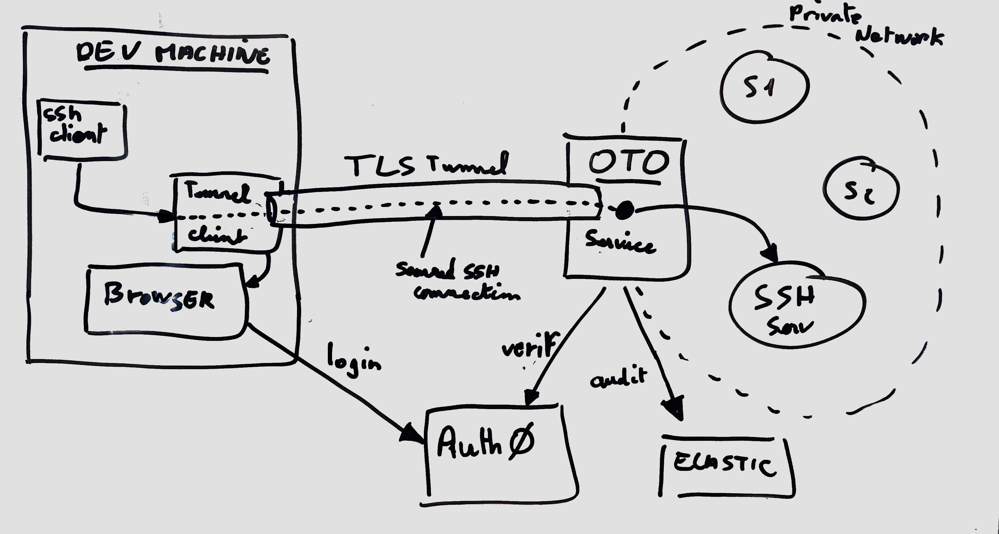

# TCP tunnel client

The idea here is to provide a secure way to access any TCP resource proxied by Otoroshi through a secured, authenticated, audited TLS tunnel. 
To do that, you'll need a local client to create the tunnel from your machine to Otoroshi. Encrypted underlying connections will pass through Otoroshi whitout being decrypted. The underlying connections will be untouched by Otoroshi.

The client can use enterprise proxies and client certificates. This client can use Otoroshi apikeys or authentication modules (like OAuth2, with browser login) to access services.

## Install dependencies

```sh
# with node 12.x
yarn install
```

## Try it



Define an otoroshi service on `http://foo.oto.tools:8080` that target your local ssh server at `http://127.0.0.1:22` (here `http://` is irrelevant, it's just a UI issue) and enable the `Enable TCP tunneling` flag. 

 Then either activate 

* public access by defining a `/.*` public pattern for the service
* apikey access by not defining public patterns or by defining private patterns
* authenticated access by enforcing user authentication in the `authentication` section

Run the local tunnel client with :

```sh
# test public access
yarn start -- --access_type=public --remote=http://http://foo.oto.tools:8080 --port=2222

# test apikey access
yarn start -- --access_type=apikey apikey=clientId:clientSecret --remote=http://http://foo.oto.tools:8080 --port=2222

# test session access
yarn start -- --access_type=session --remote=http://http://foo.oto.tools:8080 --port=2222
```

or you can specify multiple tunnels at the same time using a config file like

```json
{
  "name": "My dev tunnels",
  "tunnels": [
    {
      "enabled": true,
      "name": "Service foo",
      "access_type": "session",
      "remote": "http://foo.oto.tools:9999",
      "port": 2222
    },
    {
      "enabled": false,
      "name": "Service 2",
      "access_type": "session",
      "remote": "http://foo.oto.tools:9999",
      "port": 2223
    },
    {
      "enabled": true,
      "name": "Service 3",
      "access_type": "apikey",
      "remote": "http://foo2.oto.tools:9999",
      "port": 2224,
      "apikey": "clientId:clientSecret"
    },
    {
      "enabled": true,
      "name": "Service 4",
      "access_type": "public",
      "remote": "http://foo3.oto.tools:9999",
      "port": 2225
    }
  ]
}
```

and run it like

```sh
yarn start -- --config=./tunnels.json
```

if you use the `session` access type, you'll have to login in your browser, copy the session token and paste it in your terminal.

Then try to access the service from your ssh client

```sh
ssh localuser@127.0.0.1 -p 2222
```